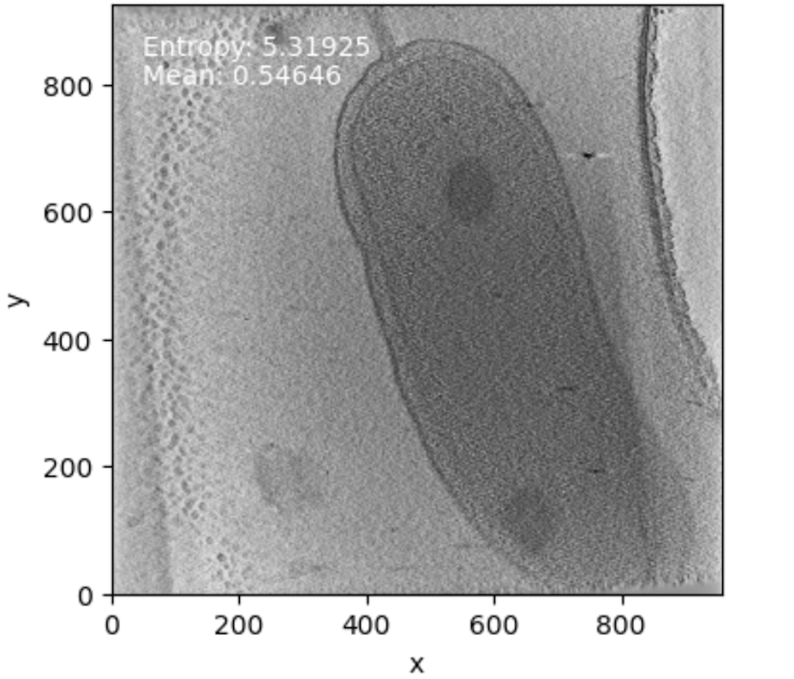
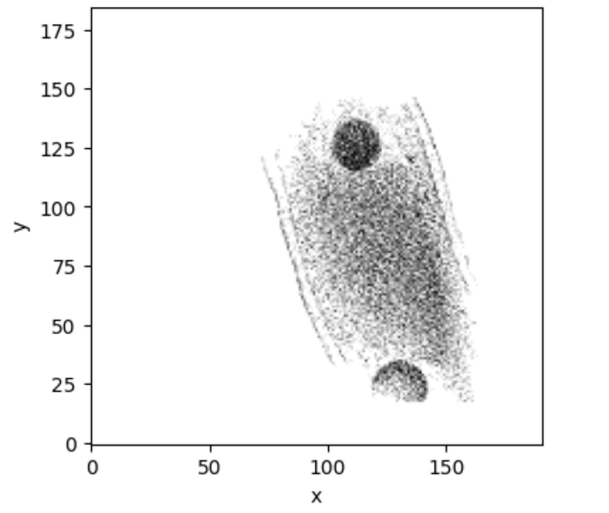
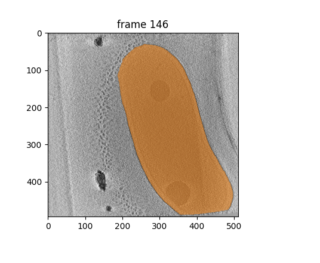

ABLA (Automated Bacterial Labeling Annotations)
=======================================

Why Search Everywhere? Smart Membrane Segmentation for Particle Detection
---------------------------------------------------------------------
### Abstract

Particle identification in cryo-electron tomography (cryo-ET) remains a significant challenge due to inherently low signal-to-noise ratios, variable particle characteristics, and the extensive search volumes required for analysis. We present ABLA (Automated Bacterial Labelling Annotations), an innovative pipeline that addresses these challenges by intelligently constraining the particle search space through precise membrane segmentation. By combining SAM2 (Segment Anything Model 2) with entropy-based slice selection and automated centroid detection, ABLA generates 3D masks of bacterial outer membranes, typically reducing the search volume to up to a quarter of the original tomogram, depending on bacterial size.
Shannon entropy helps identify optimal search regions, improving membrane-associated protein detection by eliminating areas where target proteins are unlikely to be found.

ABLA is a powerful, GPU-accelerated tool for automated membrane segmentation in biological images. Built on Facebook's SAM2 architecture, it streamlines the analysis of complex biological structures by combining state-of-the-art AI with an intuitive interface. Perfect for researchers and labs processing large datasets, ABLA reduces analysis time from hours to minutes while maintaining high accuracy and reproducibility.


*Preprocessing stage: Image enhancement and noise reduction.*


*Processing stage: SAM2 model performing membrane detection and segmentation.*


*Postprocessing stage: Refinement of segmentation boundaries and artifact removal.*

Key Features:
- Automated membrane detection and segmentation
- Batch processing capabilities
- GPU acceleration for high-throughput analysis
- User-friendly command-line interface
- Flexible input/output formats
- Reproducible results with configurable parameters

Prerequisites
------------
Note: The complete installation and environment setup process takes approximately 30 minutes.

- Python >= 3.10
- CUDA toolkit (recommended for GPU support)
- Git
- Wget
- Conda package manager

Installation
-----------
Important: The installation process might take about 30 minutes to complete. Please be patient.

1. Clone the repository: 
```bash
git clone https://github.com/matiasgp/ABLA.git
cd ABLA
```

2. Run the setup script:
```bash
chmod +x setup_environment.sh
./setup_environment.sh
```

The script will:
1. Check for required tools (conda, git, wget)
2. Verify CUDA availability
3. Ask for your preferred environment name (default: abla_env)
4. Offer to install mamba for faster package installation (recommended)
5. Create a new conda environment with all dependencies
6. Install SAM2 from the official repository
7. Download required SAM2 checkpoints
8. Verify PyTorch installation and CUDA availability

After installation, install SAM2:
```bash
# Activate your environment
conda activate your_env_name

# Install SAM2
pip install sam2
```

Dependencies
-----------
The installation will handle all required dependencies:
- Python 3.10
- PyTorch >= 2.3.1
- TorchVision >= 0.18.1
- CUDA Toolkit 11.8
- NumPy
- OpenCV
- Scikit-learn
- Pandas
- Matplotlib
- SciPy
- PSUtil
- Hydra
- MRCFile
- ONNXRuntime
- Other required Python packages

GPU Support
----------
- CUDA toolkit 11.8 is included in the installation
- The setup script will automatically detect CUDA availability
- PyTorch will be installed with CUDA support if available

Windows Users
------------
It's recommended to use Windows Subsystem for Linux (WSL):
1. Install WSL2 from Microsoft Store
2. Install Ubuntu distribution
3. Follow the Linux installation steps within WSL

Troubleshooting
--------------
1. If the environment creation times out (30 minutes):
   ```bash
   conda clean -a
   ```
   Then try the installation again

2. If you want to install mamba later:
   ```bash
   conda install mamba -n base -c conda-forge
   ```

3. To verify the installation:
   ```python
   import torch
   print('PyTorch version:', torch.__version__)
   print('CUDA available:', torch.cuda.is_available())
   ```

4. If SAM2 installation fails:
   - Check the analyzer/sam2 directory exists
   - Verify git clone of SAM2 repository succeeded
   - Check SAM2 checkpoints were downloaded correctly

Verification
-----------
After installation, verify setup:
1. Activate environment:
   ```
   conda activate your_env_name
   ```

2. Run Python and verify imports:
   ```python
   import torch
   print(torch.__version__)
   print(torch.cuda.is_available())
   ```

3. Test ABLA:
   ```python
   from ABLA.abla import main
   ```

Additional Notes
--------------
- Keep your GPU drivers updated
- For production use, consider using specific version numbers in environment.yml
- Regular updates may be required for security and performance improvements

Support
-------
For issues:
1. Check the troubleshooting section
2. Verify all prerequisites are met
3. Create an issue on the GitHub repository with:
   - Full error message
   - System information
   - CUDA version (if applicable)
   - Installation method used

SAM2 Integration
--------------
ABLA uses Meta's Segment Anything Model 2 (SAM2) for membrane segmentation. The SAM2 model and code are from [facebookresearch/sam2](https://github.com/facebookresearch/sam2).

If you use ABLA in your research, please cite both ABLA and SAM2:

```bibtex
@article{ravi2024sam2,
  title={SAM 2: Segment Anything in Images and Videos},
  author={Ravi, Nikhila and Gabeur, Valentin and Hu, Yuan-Ting and Hu, Ronghang and Ryali, Chaitanya and Ma, Tengyu and Khedr, Haitham and R{\"a}dle, Roman and Rolland, Chloe and Gustafson, Laura and Mintun, Eric and Pan, Junting and Alwala, Kalyan Vasudev and Carion, Nicolas and Wu, Chao-Yuan and Girshick, Ross and Doll{\'a}r, Piotr and Feichtenhofer, Christoph},
  journal={arXiv preprint arXiv:2408.00714},
  url={https://arxiv.org/abs/2408.00714},
  year={2024}
}
```

For more information about SAM2, visit their [GitHub repository](https://github.com/facebookresearch/sam2).

Directory Structure
------------------
After installation, your ABLA directory should look like this:
```
ABLA/
├── analyzer/
│   └── sam2/
│       └── sam2/           # SAM2 repository
│           ├── checkpoints/
│           │   └── ...     # Model weights
│           └── ...         # SAM2 source files
├── environment.yml
├── setup_environment.sh
└── ... other ABLA files
```

Make sure SAM2 is installed in the correct location as shown above. This structure is required for ABLA to properly integrate with SAM2.

Future Improvements
------------------
The following parts of the project could be enhanced or completed:

1. Environment Setup
   - Add support for different Python versions
   - Include automated CUDA toolkit installation
   - Add validation steps for environment setup

2. Documentation
   - Add detailed API documentation
   - Include more usage examples
   - Create troubleshooting guide for common issues

3. Testing
   - Add unit tests
   - Create integration tests
   - Implement automated testing workflow

4. Features
   - Add support for additional model architectures
   - Implement batch processing capabilities
   - Create visualization tools

5. Performance
   - Optimize memory usage
   - Improve processing speed
   - Add multi-GPU support

6. User Interface
   - Create command-line interface
   - Develop web interface
   - Add progress bars for long operations

If you'd like to contribute to any of these improvements, please submit a pull request or open an issue for discussion.

Usage
-----
After installation, you can run ABLA using the main script:

```bash
python abla.py
```

The script will prompt you for several inputs:

1. Dataset Path:
   - Enter the path to your dataset
   - Press Enter to use the default path from config

2. Dataset Name:
   - Enter a name for your dataset
   - This will be used to create a results directory

3. File Extension:
   - Enter the file extension for your tomograms
   - Press Enter to use the default extension

4. Batch Size:
   - Enter the number of tomograms to process simultaneously
   - Press Enter to use the default batch size
   - Must be a positive integer

5. Segmentation Points:
   - Enter the number of negative points to generate
   - Enter the number of positive points to generate
   - (these points will be used as seeds for the segmentation model) we recommend using the default values
   - Press Enter for default values
   - Must be positive integers

Example Usage:
```bash
$ python abla.py
Enter the path to your dataset (press Enter for default): /path/to/data
Enter a name for this dataset: experiment_1
Enter file extension (press Enter for default=.rec): 
Enter batch size (press Enter for default=1): 8
Enter number of negative points (press Enter for default=2): 
Enter number of positive points (press Enter for default=3): 
```

The script will:
1. Load and validate your dataset
2. Initialize the membrane segmentation analyzer
3. Process images in batches
4. Save results in the specified directory
5. Clean up GPU memory if CUDA was used

Processing Times:
- First tomogram takes longer due to model initialization and CUDA setup
- Average processing time per tomogram: ~1 minute 15 seconds
- Tested on NVIDIA GeForce RTX 3090 GPU
- Performance may vary depending on your hardware configuration

Results will be saved in:
```
results/[dataset_name]/
```
